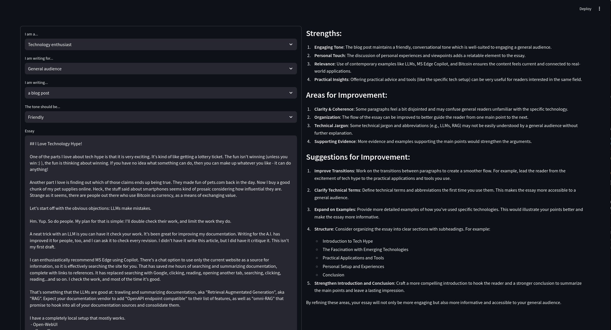

# Essay Buddy - an LLM-powered writing assistant

Would you like a little help writing essays, whether it is a README, blog post, or even something for school? Immediate and honest feedback for writing can help make your writing better. You can get that feedback without constantly harassing your friends and colleagues.

It uses the LLM model to generate text based on a prompt. It offers some options for the kind of writing you are trying to do, with various audiences, tones, and target audiences.

## Screenshot

Essay Buddy gives a pretty detailed breakdown about the *style* of the essay, without diving into the content itself. It isn't a replacement for human editing, but it is a good way to get started on an essay.

On the left are the options and textarea for the essay. There are several fields to customize the evaluation. 

 - "I am a...", with options for "IT specialist", "Technical writer", "College student", and more.
 - "I am writing for...", with options for "IT specialists", "an academic audience", etc.
 - "I am writing...", with options for "a blog post", "an English essay", "a README.md", etc.
 - "The tone should be...", with options for "Neutral", "Friendly", "Professional", etc.

On the right is the feedback given by the LLM. It should always follow that general format.




## Installation

This uses [Poetry](https://python-poetry.org/) for dependency management.  To install the dependencies, run:

```
poetry install
```

There is a `requirements.txt` file for those who don't want to use Poetry. Setting up a virtual environment, etc., is left a an exercise for the user. Poetry makes it easy, if you're looking for "easy".

## Usage

To run the application:

```
cd essaybuddy
OPENAI_API_KEY=<your api key> poetry run streamlit run main.py

```
A browser window should open up with the application. If you don't want the browser
to open automatically, add `--server.headless true` to the end of the command.